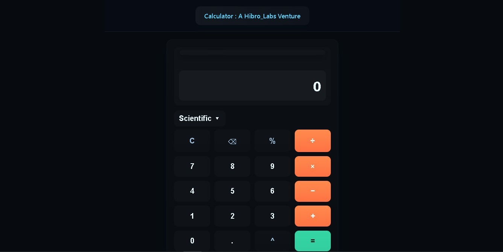

🧮 Modern Scientific + Standard Calculator - A Hibro_Labs Venture

A beautifully designed, responsive, and feature-rich calculator built using HTML, CSS, and JavaScript.
It includes both standard and scientific modes, a premium glass-morphic UI, live expression preview, keyboard input support, and smooth mobile responsiveness.

🚀 Features
🔹 Premium Modern UI

Glassmorphism-inspired interface

Smooth hover & press animations

Neon accent theme

Dark, elegant background for professional feel

🔹 Standard Calculator Functions

Addition, subtraction, multiplication, division

Percentage key

Clear (AC) & Delete (⌫)

Automatically continues calculations using result

Accurate evaluation logic

🔹 Scientific Mode

Expands inside the same calculator (no shifting UI)

Includes:

Square (x²)

Square root (√x)

Power (xʸ)

Logarithm

Trigonometric functions: sin, cos, tan

Constants: π and e

Smooth expand/collapse animation

🔹 Enhanced Display System

Shows full input expression above the result

Clean and readable result output

Floating expression box with shadow depth

🔹 Keyboard Support

Type numbers directly from keyboard

Supports:

Numbers

+, -, *, /

Enter (=)

Backspace (delete)

Escape (clear)

🔹 Fully Responsive

Works flawlessly on mobile, tablet, and desktop

Buttons resize elegantly

Layout remains consistent and visually balanced

🎨 Visual Highlights

Neon accent buttons for operators

Dedicated colors for =, operators, numbers, and scientific keys

Glassy floating expression overlay

Soft shadows for premium depth

Sticky header and footer with brand identity

🏷 Branding
Header:

Calculator : A Hibro_Labs Venture

Footer:

Created by Yadnesh Saindane
[https://yadneshportfolio.vercel.app/]
© Hibro_Labs Production

📱 Perfect for Learning & Showcasing

This project is ideal for:

Web development practice

UI/UX design demonstration

JavaScript logic understanding

Scientific calculator implementation reference
